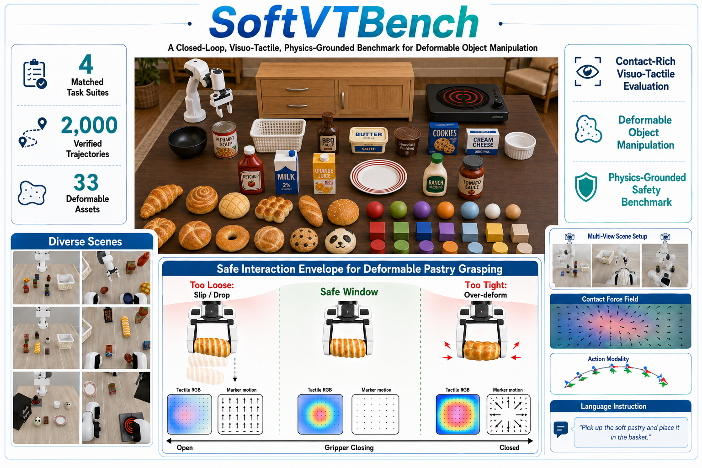
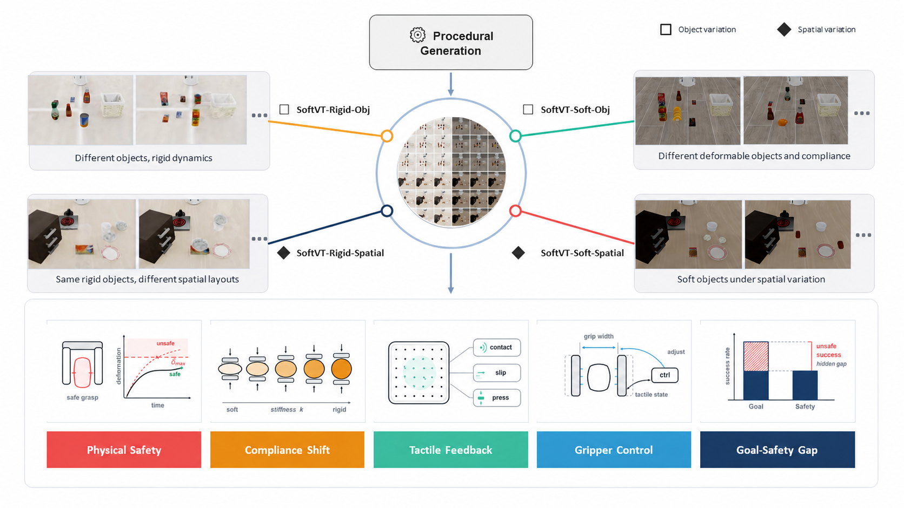
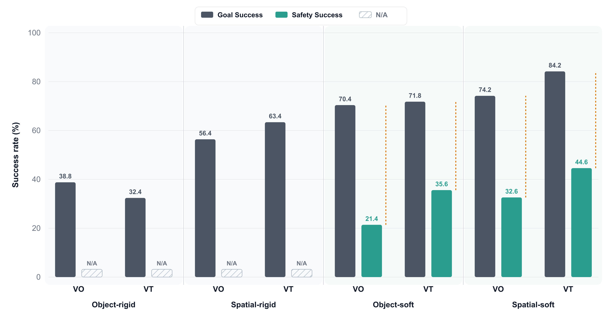

# SoftVTBench

### A Safety-Aware Visuo-Tactile Benchmark for Physically Constrained Robotic Manipulation of Deformable Objects

Bowen Jing<sup>1,\*</sup>, Mingxin Wang<sup>1,2,\*</sup>, Ruiyang Hao<sup>3</sup>, Chenchen Ge<sup>1,4</sup>,
Hanwen Shen<sup>5</sup>, Junjie He<sup>6</sup>, Yang Cui<sup>7</sup>, Yiming Hou<sup>1,4</sup>,
Weitao Zhou<sup>2,8,‡</sup>, Jiawei Wang<sup>8</sup>, Minglei Li<sup>8</sup>,
Dandan Zhang<sup>9</sup>, Ding Zhao<sup>10</sup>, Houde Liu<sup>2</sup>, Xiaofan Li<sup>11</sup>,
Si Liu<sup>12</sup>, Ping Luo<sup>13</sup>, Haibao Yu<sup>1,13,‡</sup>

<sup>1</sup>Tuojing Intelligence &nbsp;·&nbsp; <sup>2</sup>Tsinghua University &nbsp;·&nbsp;
<sup>3</sup>King's College London &nbsp;·&nbsp; <sup>4</sup>Southeast University &nbsp;·&nbsp;
<sup>5</sup>Stevens Institute of Technology &nbsp;·&nbsp;
<sup>6</sup>The Hong Kong University of Science and Technology (GZ) &nbsp;·&nbsp;
<sup>7</sup>The University of Manchester &nbsp;·&nbsp; <sup>8</sup>Simple AI &nbsp;·&nbsp;
<sup>9</sup>Imperial College London &nbsp;·&nbsp; <sup>10</sup>Carnegie Mellon University &nbsp;·&nbsp;
<sup>11</sup>Zhejiang University &nbsp;·&nbsp;
<sup>12</sup>Beihang University &nbsp;·&nbsp; <sup>13</sup>The University of Hong Kong

\* Equal contribution &nbsp;&nbsp; ‡ Corresponding author

[Paper (coming soon)](#) &nbsp;|&nbsp; [Code](https://github.com/TuojingAI/SoftVTBench) &nbsp;|&nbsp; [Dataset (coming soon)](#) &nbsp;|&nbsp; [Citation](#citation)



SoftVTBench performs contact-rich visuo-tactile evaluation under a hidden safe interaction envelope: too
loose causes slip or drop, too tight causes over-deformation, and only the safe window between them
satisfies both task and safety objectives.

## Abstract

Deformable object manipulation poses challenges beyond task completion: successful execution must also
maintain safe physical interaction, holding the object stably without slip or drop while avoiding excessive
deformation. However, existing manipulation benchmarks are predominantly success-oriented and rarely
evaluate whether a policy remains physically safe throughout execution. We present **SoftVTBench**, a
safety-aware visuo-tactile benchmark for physically constrained deformable object manipulation. Built in
Isaac Sim with finite-element-simulated deformable objects, SoftVTBench provides multi-view RGB
observations, RGB tactile sensing with marker motion, proprioception, and language instructions, and
defines four matched task suites over object type (deformable vs. rigid) and variation axis (object vs.
spatial). It reports *Goal Success* and *Safety Success* separately, where Safety Success additionally
requires no drop and peak object deformation below a calibrated, object-specific threshold, computed from
privileged FEM simulation states that are hidden from the policy. We implement π<sub>0.5</sub>-based
baselines under this protocol. Experiments show that success-only evaluation substantially overstates
policy performance — a large fraction of goal-completing rollouts violate physical safety — and that adding
tactile sensing improves Safety Success (e.g., from 21.4% to 35.6% on object-centric deformable tasks) and
reduces object deformation during execution, while Goal Success remains comparable. SoftVTBench provides a
reproducible benchmark for studying visuo-tactile deformable manipulation under physical interaction
constraints.

## Benchmark Design

SoftVTBench performs contact-rich visuo-tactile evaluation of robot policies under two coupled
requirements: completing the manipulation goal and maintaining safe physical interaction throughout
execution. A rollout is considered
physically safe only if the object remains stably grasped without slip or drop, and its peak deformation
stays below a calibrated, object-specific threshold. By reporting Goal Success and Safety Success
separately, SoftVTBench exposes goal-complete but physically unsafe rollouts that are hidden by
success-only evaluation.

SoftVTBench instantiates this evaluation protocol in Isaac Sim with simulated deformable objects based on
finite element method (FEM) soft-body dynamics and a Franka Panda arm with a parallel-jaw gripper carrying
GelSight Mini tactile sensors on both fingers. The benchmark provides synchronized third-person and wrist
RGB observations, tactile RGB images, marker-motion fields, proprioception, and a standardized end-effector
and gripper action interface, all synchronized at 20 Hz.

```
Safety Success ⊆ Goal Success
Safety Success = Goal Success AND NoDrop AND D_peak ≤ τ_o
```

`D_peak` is the peak object-size-normalized FEM-RMS deformation over the rollout, computed after removing
global rigid-body motion. `τ_o` is an object-specific threshold calibrated from an offline compression
sweep. Both are computed from privileged simulator ground truth and hidden from the policy.



SoftVTBench's four matched task suites are generated around a shared procedural pipeline, and jointly
probe physical safety, compliance shift, tactile feedback, and gripper control — exposing the Goal–Safety
gap that success-only evaluation hides.

## Task Suites

A matched 2×2 design over object type (rigid vs. deformable) and variation axis (object vs. spatial).

**Rigid control suites** — LIBERO-style rigid-object suites that establish baseline manipulation and
spatial-variation competence before deformable-object safety is introduced.

| Suite | Description |
|---|---|
| **Object-Rigid** | Rigid LIBERO-style object tasks re-executed through the SoftVTBench tactile-equipped sensing and recording stack. Tests basic pick-and-place competence under object identity variation. |
| **Spatial-Rigid** | Rigid LIBERO-style spatial tasks under the same sensing stack. Tests robustness to spatial variation — localization, approach, and transfer across changing layouts. |

**Deformable main suites** — grasp-and-place suites where the object must reach its target region without
dropping or over-deforming.

| Suite | Description |
|---|---|
| **Object-Soft** | The robot grasps a deformable object and places it into a fixed target container while avoiding drop and excessive deformation. Object identity, geometry, and material compliance vary across tasks. |
| **Spatial-Soft** | The same grasp-and-place objective under spatial variation: two visually identical instances appear per scene, and the language instruction specifies which one to manipulate under changing layouts. |

Demo videos for all four suites are in [`task_video/`](task_video/).

## Experimental Results

π<sub>0.5</sub>-Vision (VO) vs. π<sub>0.5</sub>-Visuo-Tactile (VT), evaluated under identical physical and
task conditions.

### Main Results

| Suite | Method | Goal Success | Safety Success |
|---|---|---|---|
| Object-Rigid | VO | 38.8% | N/A |
| Object-Rigid | VT | 32.4% | N/A |
| Spatial-Rigid | VO | 56.4% | N/A |
| Spatial-Rigid | VT | 63.4% | N/A |
| Object-Soft | VO | 70.4% | 21.4% |
| Object-Soft | VT | 71.8% | 35.6% |
| Spatial-Soft | VO | 74.2% | 32.6% |
| Spatial-Soft | VT | 84.2% | 44.6% |

VO: vision-only π<sub>0.5</sub> policy (binary gripper command). VT: visuo-tactile π<sub>0.5</sub> policy,
additionally observing tactile RGB and marker-motion history with a continuous gripper command. Safety
Success is not defined (N/A) for rigid suites, which carry no deformation constraint.



Goal Success and Safety Success across suites. For rigid suites, deformation-based safety constraints are
not applicable (N/A). For deformable suites, the gap between Goal Success and Safety Success indicates
unsafe goal completions caused by excessive deformation, dropping, or unstable contact.

### Deformation Distribution

| Suite | Method | Mean | P5 | Median | P95 |
|---|---|---|---|---|---|
| Object-Soft | VO | 16.10% | 4.30% | 10.65% | 44.70% |
| Object-Soft | VT | 15.12% | 3.90% | 8.67% | 38.81% |
| Spatial-Soft | VO | 13.16% | 5.16% | 10.75% | 28.96% |
| Spatial-Soft | VT | 11.58% | 4.75% | 9.67% | 26.56% |

FEM-RMS deformation over all deformable-object rollouts, reported as a percentage of the object
bounding-box diagonal. Lower values indicate safer physical interaction.

### Analysis

Tactile information does not consistently improve performance on rigid-object tasks: VT trails VO on
Object-Rigid (32.4% vs. 38.8%) but leads on Spatial-Rigid (63.4% vs. 56.4%). When deformation-related
safety constraints are absent, visual observations and proprioception already provide the primary
information needed for task completion, and tactile sensing yields no consistent gain.

In contrast, VT shows clear advantages on deformable-object tasks. Goal Success is comparable between VO
and VT (Object-Soft: 70.4% vs. 71.8%), but VT obtains substantially higher Safety Success (Object-Soft:
21.4% → 35.6%; Spatial-Soft: 32.6% → 44.6%). Tactile sensing is not primarily helping the object reach the
target — it is improving contact regulation during execution, reducing slippage, over-compression, and
unstable grasping.

The deformation statistics confirm this: VT lowers mean, median, and P95 deformation on both deformable
suites, showing that tactile feedback shifts the entire interaction distribution toward safer contact, not
just the fraction that clears the safety threshold. Together, these results show that success-only
evaluation substantially overstates policy performance on deformable manipulation, and that tactile
sensing is most valuable precisely where physical safety is at stake.

## Dataset

| | |
|---|---|
| Task Suites | 4 |
| Episodes | 2,000 |
| Assets | 33 |
| Core Metrics | Goal Success / Safety Success |

Each episode contains synchronized third-person and wrist RGB, left/right tactile RGB and marker-motion
fields, robot proprioception, end-effector and gripper action trajectories, suite and task identifiers, and
evaluator-only privileged signals (FEM nodal deformation, contact status, drop events). All streams are
recorded at 20 Hz, with deformable-object safety thresholds calibrated per asset from an offline
interaction calibration protocol and held out for evaluation only.

Dataset download link: coming soon.

## Citation

If you find SoftVTBench useful, please consider citing our paper.

```bibtex
@article{jing2026softvtbench,
  title   = {SoftVTBench: A Safety-Aware Visuo-Tactile Benchmark for
             Physically Constrained Robotic Manipulation of Deformable Objects},
  author  = {Jing, Bowen and Wang, Mingxin and Hao, Ruiyang and Ge, Chenchen and
             Shen, Hanwen and He, Junjie and Cui, Yang and Hou, Yiming and
             Zhou, Weitao and Wang, Jiawei and Li, Minglei and Zhang, Dandan and
             Zhao, Ding and Liu, Houde and Li, Xiaofan and Liu, Si and
             Luo, Ping and Yu, Haibao},
  year    = {2026},
  note    = {Preprint}
}
```
