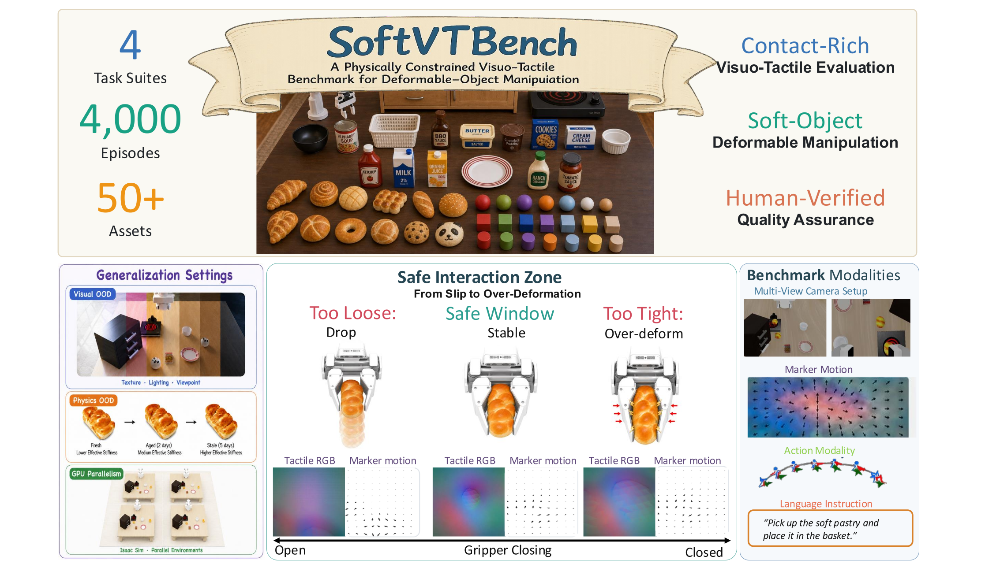
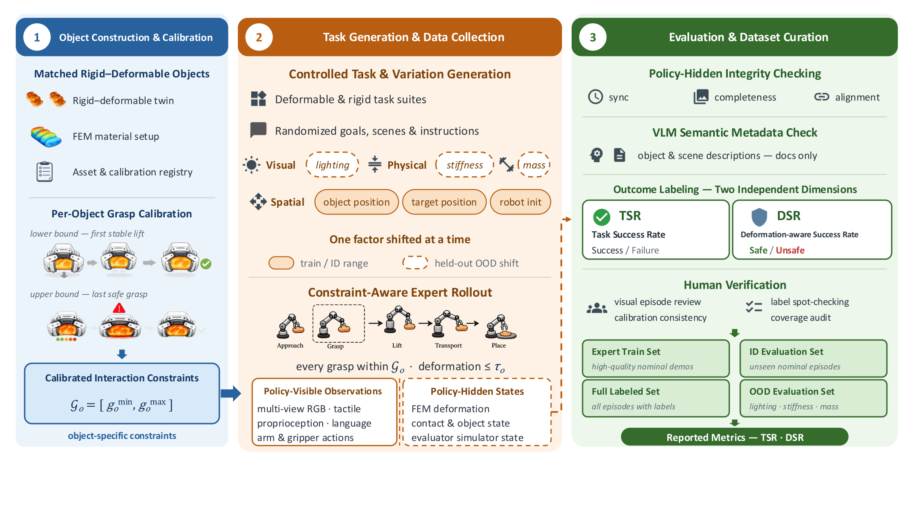
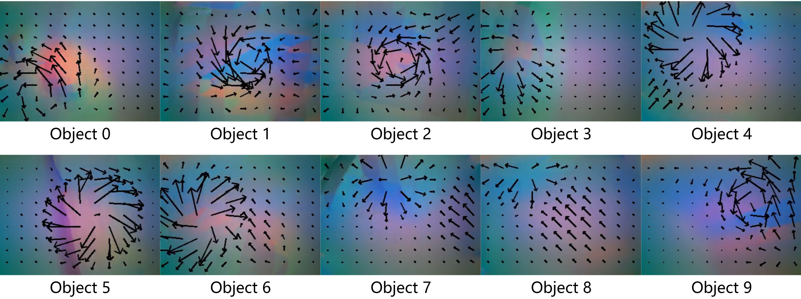
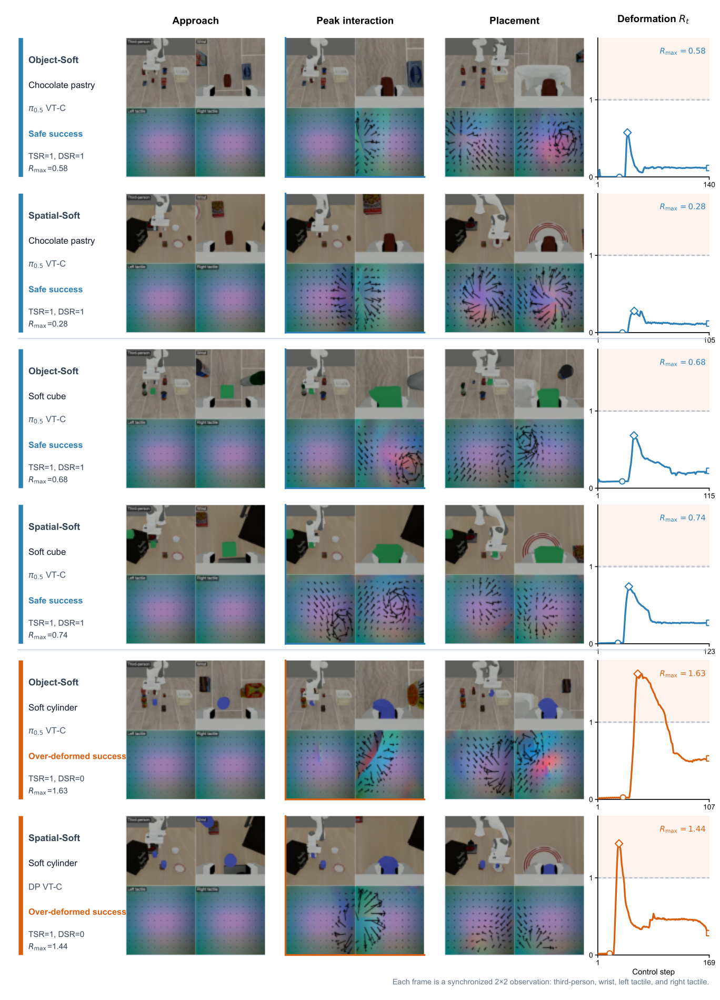
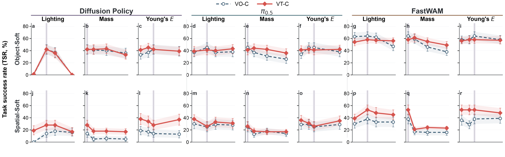

# SoftVTBench

### A Deformation-Aware Visuo-Tactile Dataset and Benchmark for Deformable-Object Manipulation

Bowen Jing<sup>1,\*</sup>, Mingxin Wang<sup>1,2,\*</sup>, Ruiyang Hao<sup>3</sup>, Chenchen Ge<sup>1,4</sup>,
Hanwen Shen<sup>5</sup>, Junjie He<sup>6</sup>, Yang Cui<sup>7</sup>, Yiming Hou<sup>1,4</sup>,
Weitao Zhou<sup>2,8,‡</sup>, Jiawei Wang<sup>8</sup>, Minglei Li<sup>8</sup>,
Dandan Zhang<sup>9</sup>, Ding Zhao<sup>10</sup>, Houde Liu<sup>2</sup>, Xiaofan Li<sup>11</sup>,
Si Liu<sup>12</sup>, Ping Luo<sup>13</sup>, Haibao Yu<sup>1,13,‡</sup>

<sup>1</sup>Tuojing Intelligence &nbsp;·&nbsp; <sup>2</sup>Tsinghua University &nbsp;·&nbsp;
<sup>3</sup>King's College London &nbsp;·&nbsp; <sup>4</sup>Southeast University &nbsp;·&nbsp;
<sup>5</sup>Stevens Institute of Technology &nbsp;·&nbsp;
<sup>6</sup>The Hong Kong University of Science and Technology (GZ) &nbsp;·&nbsp;
<sup>7</sup>University of Manchester &nbsp;·&nbsp; <sup>8</sup>Simple AI &nbsp;·&nbsp;
<sup>9</sup>Imperial College London &nbsp;·&nbsp; <sup>10</sup>Carnegie Mellon University &nbsp;·&nbsp;
<sup>11</sup>Zhejiang University &nbsp;·&nbsp;
<sup>12</sup>Beihang University &nbsp;·&nbsp; <sup>13</sup>The University of Hong Kong

\* Equal contribution &nbsp;&nbsp; ‡ Corresponding author

[Project page](https://softvtbench.github.io/) &nbsp;|&nbsp; [Paper (arXiv)](https://arxiv.org/abs/2607.04234) &nbsp;|&nbsp; [Code](https://github.com/TuojingAI/SoftVTBench) &nbsp;|&nbsp; Data: [Hugging Face](https://huggingface.co/datasets/Arthur12137/SoftVTBench) · [ModelScope](https://modelscope.cn/datasets/Arthur12137/SoftVTBench) &nbsp;|&nbsp; [Citation](#citation)



4,000 demonstrations, four diagnostic suites, 50+ assets — deformable objects and their visually matched
rigid twins. Between a grasp too loose to hold and one tight enough to crush lies a narrow safe window, and
only touch observes it from the inside.

## Abstract

A policy can complete a manipulation task while letting the object slip — or by crushing it. Task success
sees neither. **SoftVTBench** is a visuo-tactile dataset and benchmark that separates the two. It contains
4,000 expert demonstrations over 40 tasks and 50+ assets, each episode synchronizing multi-view RGB,
dual-finger tactile RGB and marker motion, proprioception, language, and actions at 20 Hz — alongside
evaluator-only finite-element (FEM) states the policy never sees. On top of it we define the
**Deformation-aware Success Rate (DSR)**, which credits a rollout only when the task is completed *and*
deformation stays within a per-object tolerance calibrated before any policy is trained. Across Diffusion
Policy, π<sub>0.5</sub>, and FastWAM, every one of the 12 in-distribution configurations contains successes
that violate that tolerance. Under distribution shift, visuo-tactile variants win all six task-success
comparisons and five of six on DSR — while in distribution the same comparison is split. Making touch
available is not the same as using it.

## The Metric

```
DSR  =  Task Completed   AND   Deformation Within Tolerance
```

The task predicate is purely kinematic: the **instructed** object comes to rest in the target region. The
deformation side is read from FEM states the policy never sees, and compared against a tolerance calibrated
per object *before* any policy is trained — so no method can move the bar it is scored against. Task
Success Rate (TSR) is reported alongside DSR, which makes their difference an exact count of the rollouts
that reached the target by mishandling the object.

| | |
|---|---|
| **What the policy sees** | Third-person and wrist RGB, dual-finger tactile RGB and marker motion, proprioception, language. Outputs an end-effector pose target plus a gripper command (binary or continuous). |
| **What the evaluator sees** | FEM nodal positions, object poses, contact and drop events. Deformation is the peak rigid-motion-removed RMS node displacement, normalized by object size — which separates being *carried* from being *squeezed*. |
| **Calibrated up front** | A scripted grasp–lift–hold sweep fixes each object's gripper envelope and deformation tolerance before training. The full trace is released, so the criterion can be audited or rescored without new rollouts. |



Three stages: build matched rigid–deformable objects and calibrate their constraints; generate controlled
tasks and record policy-visible observations separately from evaluator-only states; screen, verify, and
label into the released train / ID / OOD splits.

### Where SoftVTBench sits

| Benchmark | Complete Task | 3D Deformable | Policy-Visible Touch | Physical Ground Truth | Deformation-Aware Eval |
|---|:--:|:--:|:--:|:--:|:--:|
| LIBERO | ✓ | ✗ | ✗ | ✗ | ✗ |
| ManiSkill2 | ✓ | ✓ | ✗ | ✓ | ✗ |
| SoftGym | ✓ | ◎ | ✗ | ✓ | ✗ |
| MoDeSuite | ✓ | ◎ | ✗ | ✓ | ✗ |
| DefGraspSim | ✗ | ✓ | ✗ | ✓ | ✓ |
| SoGraB | ✗ | ✓ | ✗ | ✓ | ✓ |
| VTDexManip | ✓ | ✗ | ✓ | ✗ | ✗ |
| ManiFeel | ✓ | ✗ | ✓ | ✗ | ✗ |
| Tabero | ✓ | ✗ | ✓ | ✗ | ◎ |
| **SoftVTBench** | ✓ | ✓ | ✓ | ✓ | ✓ |

✓ full support · ◎ partial · ✗ not supported.

## Dataset

| Suite | Object Type | Variation Axis | #Tasks | #Demos | ID Eval Episodes | OOD Conditions |
|---|---|---|---|---|---|---|
| Object-Soft | Deformable | Object identity | 10 | 1,000 | 500 | 9 |
| Spatial-Soft | Deformable | Spatial layout | 10 | 1,000 | 500 | 9 |
| Object-Rigid | Rigid twin | Object identity | 10 | 1,000 | 500 | — |
| Spatial-Rigid | Rigid twin | Spatial layout | 10 | 1,000 | 500 | — |
| **Total** | — | — | **40** | **4,000** | **2,000** | — |

OOD covers nine held-out conditions on the two deformable suites — three levels each of **lighting**
(67.5 / 180 / 270), **mass** (×1.25 / ×1.75 / ×2.5), and **Young's modulus** (×0.5 / ×0.8 / ×2.0). One
factor moves at a time; the task, initial state, and seed are reused from its in-distribution reference.



Tactile RGB with marker-motion overlay at the moment of grasp, for the ten Object-Soft objects. Different
geometry, compliance, and contact area produce visibly different contact patches and shear fields — cues no
external camera provides.

- **Policy-visible** — third-person + wrist RGB · dual-finger tactile RGB + 11×9 marker fields ·
  proprioception · language · actions in both binary and continuous gripper encodings
- **Evaluator-only** — FEM nodal positions · object poses · contact and drop events; released in full,
  never exposed to a policy
- **Simulator** — Isaac Sim 4.5.0 · Isaac Lab 0.41.3 · PhysX 5 GPU FEM · Franka + Panda gripper ·
  60 Hz physics, 20 Hz control
- **Tactile** — GelSight Mini via TacEx · Taxim optics · FOTS marker motion
- **Quality control** — automatic integrity screening + human verification on every episode
- **Headroom** — expert demos reach a median 43% of the tolerance; none exceeds it

**Download** — [Hugging Face](https://huggingface.co/datasets/Arthur12137/SoftVTBench) ·
[ModelScope](https://modelscope.cn/datasets/Arthur12137/SoftVTBench) (Apache-2.0)

## Task Suites

A matched 2×2 over object type (deformable vs. rigid twin) and variation axis (object identity vs. spatial
layout), with one shared pick-and-place skill throughout.

| Suite | Description |
|---|---|
| **Object-Soft** | Fixed layout, ten different objects — six bakery-style meshes and four procedural primitives. The grasp must adapt to each object's geometry and compliance. |
| **Spatial-Soft** | Two identical instances per scene; only the instruction says which one. Success checks the identity of the object that actually moved. |
| **Object-Rigid** | Object-Soft replicated with rigid twins. Isolates object-identity adaptation from deformability. |
| **Spatial-Rigid** | Spatial-Soft replicated with rigid twins. Isolates language-grounded target selection from deformability. |

Each rigid twin shares the mesh, texture, and mass of its deformable counterpart, with stiffness raised
until deformation is negligible. Demo videos for all four suites are in [`task_video/`](task_video/).

## Results

Diffusion Policy, π<sub>0.5</sub>, and FastWAM under paired vision-only (VO) and visuo-tactile (VT) inputs,
on identical episodes and seeds. `-B` and `-C` denote the binary and continuous gripper encodings.

### In-distribution — TSR vs. DSR (%)

| Model | Input | Object-Soft TSR | Object-Soft DSR | Spatial-Soft TSR | Spatial-Soft DSR |
|---|---|---|---|---|---|
| Diffusion Policy | VO-C | 37.4 | 33.6 | 15.6 | 13.4 |
| Diffusion Policy | VT-C | 40.0 | 30.4 | 33.0 | 25.0 |
| π<sub>0.5</sub> | VO-C | 41.6 | 38.4 | 26.0 | 22.6 |
| π<sub>0.5</sub> | VT-C | 41.4 | 35.0 | 27.6 | 22.0 |
| FastWAM | VO-C | **62.0** | **58.0** | 37.0 | 36.6 |
| FastWAM | VT-C | 57.6 | 54.4 | **56.4** | **56.0** |

**DSR is below TSR in all twelve configurations.** For Diffusion Policy VT-C the gap is 9.6 points on
Object-Soft — 24% of its own successes, an exact count of 48 episodes. It also flips rankings: TSR puts
VT-C above VO-C (40.0 vs. 37.4), DSR reverses it (30.4 vs. 33.6). And the gap is family-dependent: 10–24%
for Diffusion Policy, 8–20% for π<sub>0.5</sub>, but only 0.7–6.5% for FastWAM.



**Every rollout here succeeds at the task.** Blue stays within tolerance; orange crosses it during the
grasp and stays elevated through transport — then places the object correctly. The RGB views are hard to
tell apart. The marker fields and the deformation trace are not.

### Deformable vs. matched rigid twin (TSR, %)

| Model | Input | Object: Rigid | Object: Soft | Spatial: Rigid | Spatial: Soft |
|---|---|---|---|---|---|
| Diffusion Policy | VO-C | 40.0 | 37.4 | 14.0 | 15.6 |
| Diffusion Policy | VT-C | 35.0 | 40.0 | 11.0 | 33.0 |
| π<sub>0.5</sub> | VO-C | 60.0 | 41.6 | **50.4** | 26.0 |
| π<sub>0.5</sub> | VT-C | 59.6 | 41.4 | **54.0** | 27.6 |
| FastWAM | VO-C | **64.0** | **62.0** | 25.0 | **37.0** |
| FastWAM | VT-C | **61.6** | **57.6** | 30.0 | **56.4** |

**Deformability does not cost the same for everyone — and can pay.** π<sub>0.5</sub> drops 18.4 and 24.4
points going rigid → soft, while FastWAM *gains* 12.0 on spatial variation. Diffusion Policy is not
language-conditioned, so its spatial numbers are a floor set by that limitation.

### Sensing or control granularity? (π<sub>0.5</sub> ablation, %)

| Configuration | Object-Soft TSR | Object-Soft DSR | Spatial-Soft TSR | Spatial-Soft DSR |
|---|---|---|---|---|
| VO-B | 30.2 | 27.2 | **34.2** | 20.0 |
| VO-C | **41.6** | **38.4** | 26.0 | **22.6** |
| VT-B | 41.0 | 28.0 | 30.0 | 21.4 |
| VT-C | 41.4 | 35.0 | 27.6 | 22.0 |

**A "tactile gain" can be a gripper gain.** From VO-B, continuous control alone adds 11.4 TSR points and
touch alone adds 10.8 — together they add nothing further. Meanwhile VO-C and VT-B are 0.6 points apart in
TSR but 10.4 apart in DSR. Match the action space before crediting touch.

### Out-of-distribution (%, Δ vs. ID)

| Model | Input | Object-Soft TSR | Object-Soft DSR | Spatial-Soft TSR | Spatial-Soft DSR |
|---|---|---|---|---|---|
| Diffusion Policy | VO-C | 29.2 (−8.2) | **26.6 (−7.0)** | 11.0 (−4.6) | 8.8 (−4.6) |
| Diffusion Policy | VT-C | **31.2 (−8.8)** | 25.0 (−5.4) | **25.2 (−7.8)** | **17.8 (−7.2)** |
| π<sub>0.5</sub> | VO-C | 35.8 (−5.8) | 33.2 (−5.2) | 24.4 (−1.6) | 19.4 (−3.2) |
| π<sub>0.5</sub> | VT-C | **41.0 (−0.4)** | **34.2 (−0.8)** | **28.4 (+0.8)** | **23.2 (+1.2)** |
| FastWAM | VO-C | 54.4 (−7.6) | 53.8 (−4.2) | 27.8 (−9.2) | 27.2 (−9.4) |
| FastWAM | VT-C | **55.8 (−1.8)** | **55.8 (+1.4)** | **39.4 (−17.0)** | **38.8 (−17.2)** |



The same shifts resolved by factor — lighting, mass, stiffness — for each policy and suite. 100 episodes
per point; bands are task-stratified bootstrap 95% CIs, and the pale strip marks the in-distribution
reference.

**Touch pays off under shift, not everywhere.** VT-C wins all six TSR comparisons (sign test p = 0.016) and
five of six on DSR. The pattern follows the suite more than the factor: on Spatial-Soft the tactile curve
sits at or above vision-only everywhere, while on Object-Soft the two overlap except under mass shifts —
touch only observes what happens after contact. Lighting acts before contact and degrades the pathway both
modalities share, which is why Diffusion Policy collapses at both illumination extremes regardless of
input.

**Caveat.** The released Diffusion Policy and FastWAM VT variants train at smaller effective batch sizes,
so their VO–VT comparisons describe those variants rather than isolate the modality; the π<sub>0.5</sub>
ablation is batch-matched. Everything here is simulation, and the gap to physical tactile sensors is not
characterized in this work.

## Citation

```bibtex
@article{jing2026softvtbench,
  title         = {SoftVTBench: A Deformation-Aware Visuo-Tactile Dataset and
                   Benchmark for Deformable-Object Manipulation},
  author        = {Jing, Bowen and Wang, Mingxin and Hao, Ruiyang and Ge, Chenchen and
                   Shen, Hanwen and He, Junjie and Cui, Yang and Hou, Yiming and
                   Zhou, Weitao and Wang, Jiawei and Li, Minglei and Zhang, Dandan and
                   Zhao, Ding and Liu, Houde and Li, Xiaofan and Liu, Si and
                   Luo, Ping and Yu, Haibao},
  year          = {2026},
  eprint        = {2607.04234},
  archivePrefix = {arXiv},
  primaryClass  = {cs.RO},
  url           = {https://arxiv.org/abs/2607.04234}
}
```
